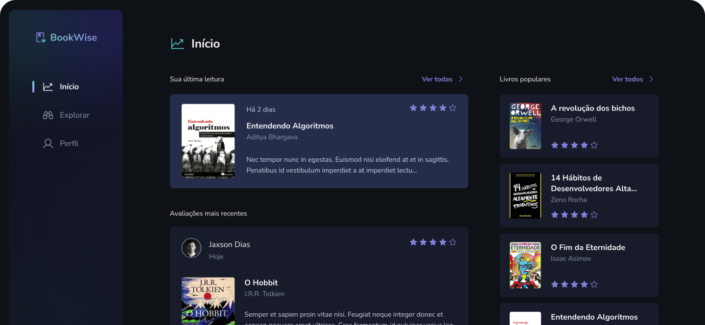

<h4 align="center">
  
</h4>

<h1 align="center">
  
</h1>

## What is this project

Bookwise is a project developed as part of the Ignite course by Rocketseat. It is the sixth challenge of the course and aims to create a recommendation platform for readers.

The main features of the platform include the ability for users to rate books, view ratings from other users, search for books, add books to a wishlist, and recommend books to others.

Throughout the development process, important web development concepts are applied, such as creating APIs, working with databases, building responsive interfaces, and implementing authentication and authorization.

## 🚀 Technologies

- [NextJS 14](https://nextjs.org/)
- [Typescript](https://www.typescriptlang.org/)
- [TailwindCss](https://tailwindcss.com/)
- [NextAuth](https://next-auth.js.org/)
- [Prisma](https://www.prisma.io/)
- [ReactQuery](https://tanstack.com/query/latest)

## ⚙️ How to run the project

```sh
# Clone the repository
git clone https://github.com/felipeolliveira/challenge-bookwise.git ./bookwise
cd bookwise

# Install the dependencies
yarn install

# Make a copy of '.env.example' to '.env'
cp .env.example .env

# Start the application
yarn run dev
```

## 📄 License

[MIT](LICENSE.txt)